## 冷蔵庫管理アプリ（レイ・コンシェルジュ）

家庭内の食材管理を効率化し、  
**食品ロスの削減と日常生活の利便性向上**を目的とした Web アプリケーションです。

---

## 概要

「レイ・コンシェルジュ」は、  
食材の登録・編集・削除といった基本的な管理機能に加え、  
賞味期限管理、廃棄率の可視化、AI を用いたレシピ検索を行える  
**冷蔵庫管理 Web アプリ**です。

実務を意識した設計・開発プロセスで作成しています。

---

## 開発背景

実生活において、冷蔵庫の中身を把握できず、

- 同じ食品を重複して購入してしまう  
- 賞味期限切れにより食品を廃棄してしまう
- お買い物中に必要なものを忘れてしまう  

といった課題がありました。

この経験から、**身近な課題をエンジニアとして解決したい**という思いで本アプリを開発しました。

---

## 学習・開発期間

- 約 **240 時間**

---

## 主な機能

- ログイン / ログアウト機能  
- 食材登録・一覧表示・編集・削除機能（CRUD）  
- 買い物候補リスト表示機能  
- 賞味期限管理機能  
- 廃棄率のグラフ表示機能  
- AI を用いたレシピ検索機能 （開発中） 
- 外部 API 連携機能  

---

## 📸 画面イメージ

### ログイン画面
- メールアドレスとパスワードでログイン可能です。

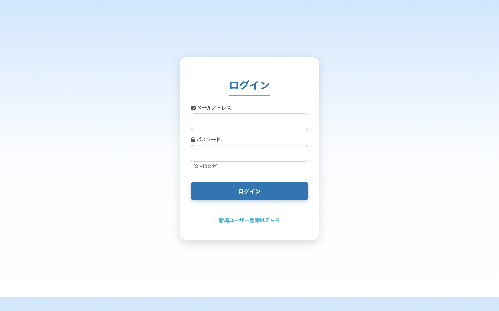

- 新規登録は画面下部から可能です。

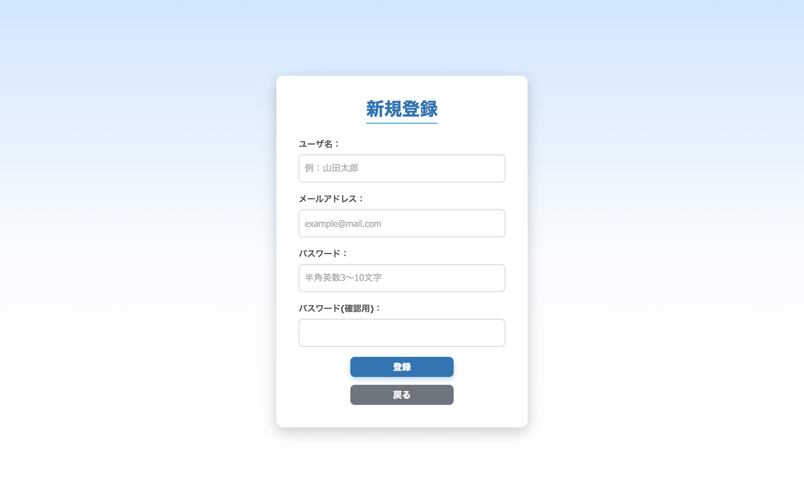

---

### メニュー画面（メイン画面）
- 食材管理や各種機能にアクセス可能です。
- 季節によって更新される、限定レシピを掲示しています。

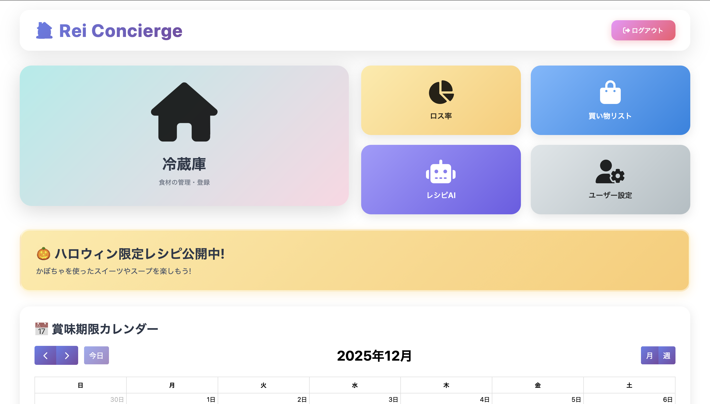

- 賞味期限カレンダーで、いち早く賞味期限が切れそうな食材を確認できます。

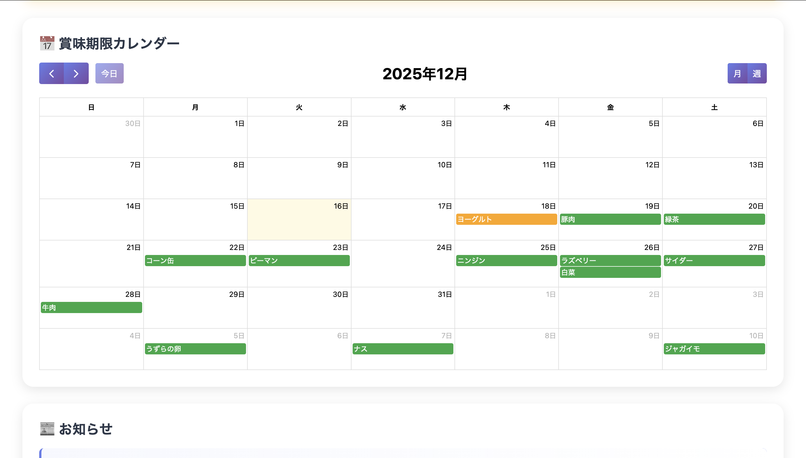
  
- 定期的に更新される、お知らせを掲示しています。

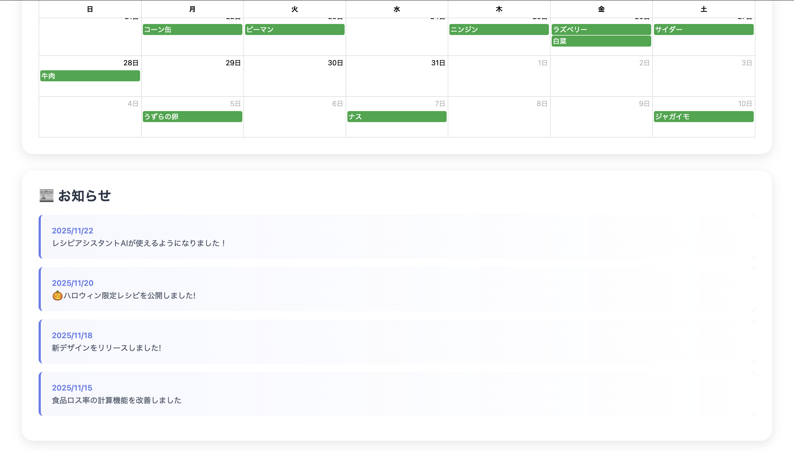

---

### ユーザ設定画面
- ユーザ情報の更新・削除ができます。

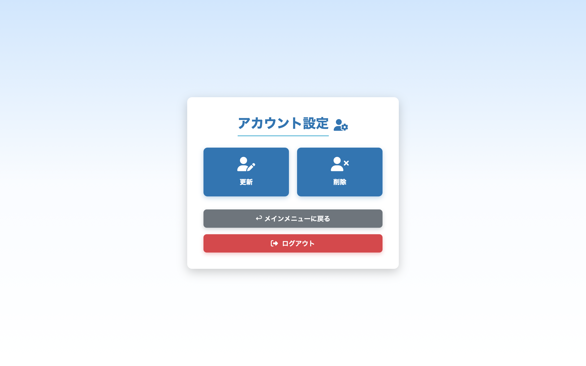

- ユーザ更新画面

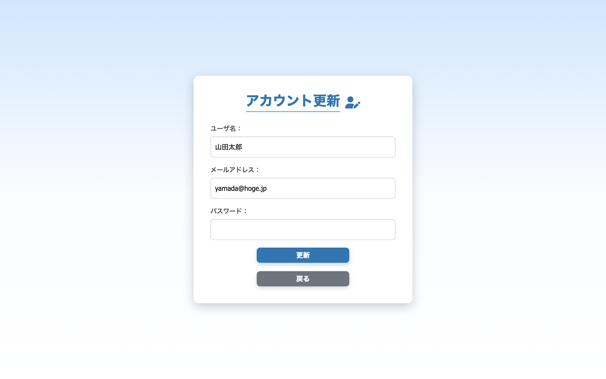

- ユーザ削除画面

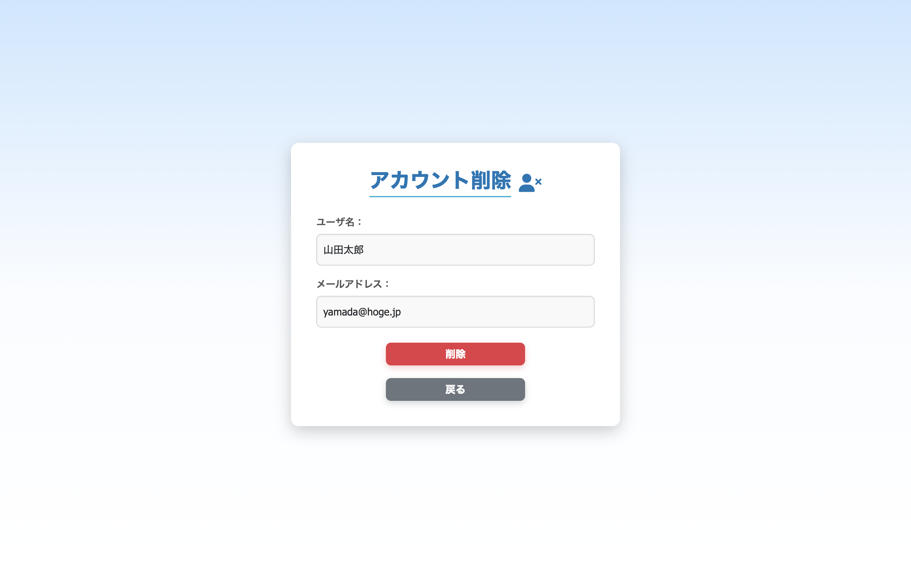

---

### 食材一覧画面
- 賞味期限が近い食材を上位に表示し、食品ロスを防ぐ設計にしています。
  
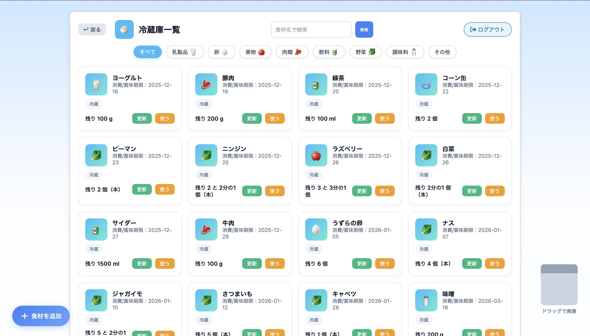

- ジャンル別表示、あいまい検索が可能となっております。

- 画面左下部の**食材を追加**のボタンから食材追加ができます。

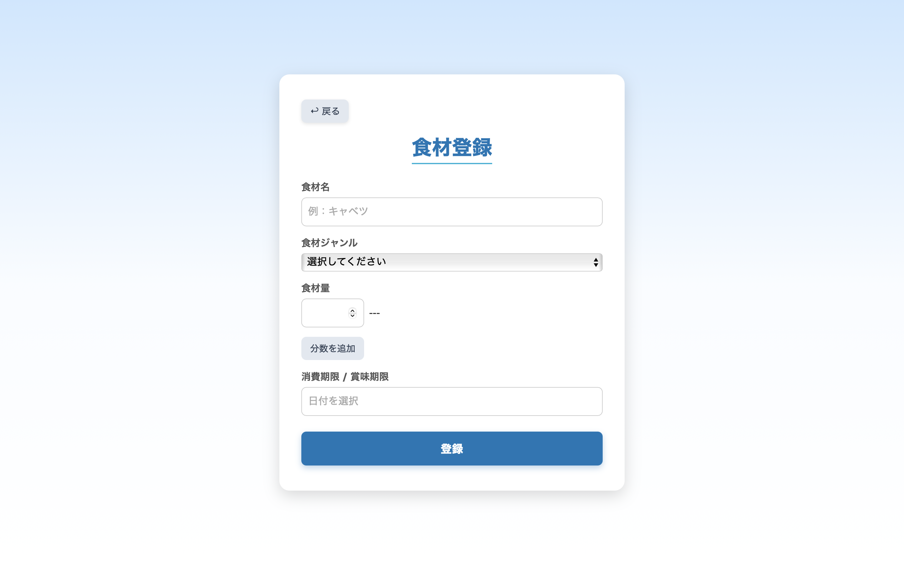

- 食材のブロックにある**更新**ボタンを押すと、食材情報の編集ができます。

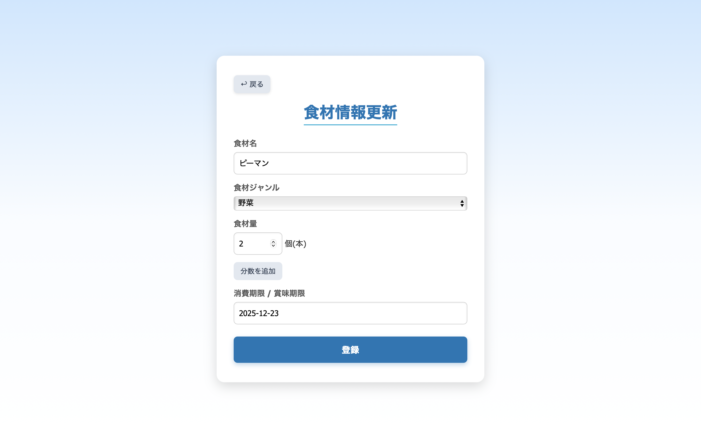

- 食材のブロックにある**使う**ボタンを押すと、食材の使用した量を登録できます。

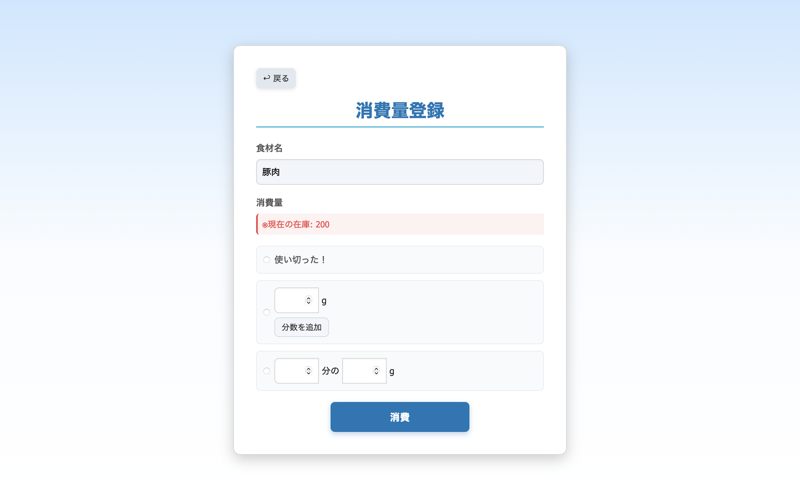

- 画面右下部にあるゴミ箱に、食材のブロックをドラッグすることによって廃棄することができます。

---

### 廃棄率グラフ画面
- 廃棄状況をグラフで可視化し、改善につなげられるようにしています。

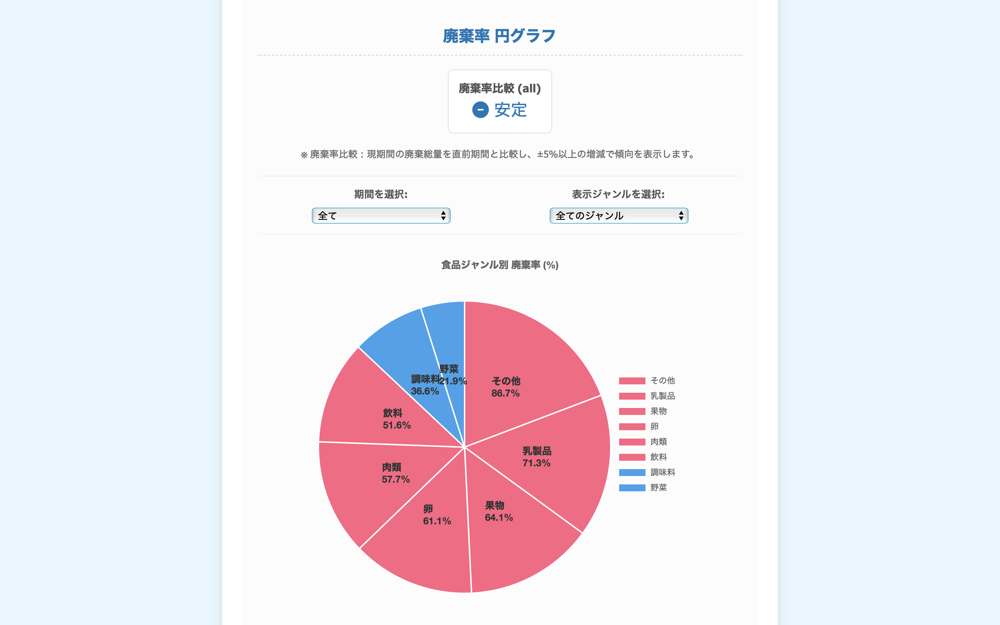

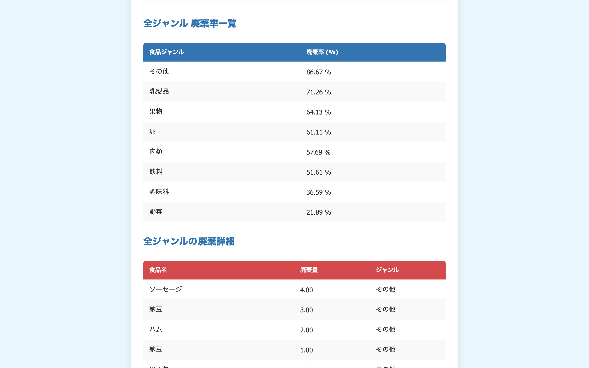

---

### AI レシピ検索画面（開発中）
- 食材やレシピに関する質問に応答する AI チャット機能を実装予定です。  
- Google Gemini API を用いた自動回答機能を組み込む予定です。  
- 現在は API キー設定やレスポンス処理の調整中で、動作確認中です。

#### 技術的アプローチ（予定）
- JavaScript でフロント側から入力を取得  
- Gemini API に送信し、AIがレシピや料理アドバイスを返す  
- 返答をチャット形式で画面に表示  
- 今後は API キーのサーバー側管理やエラーハンドリングを強化予定

---

### 買い物候補リスト画面
- 不足している食材を一覧で確認できます。

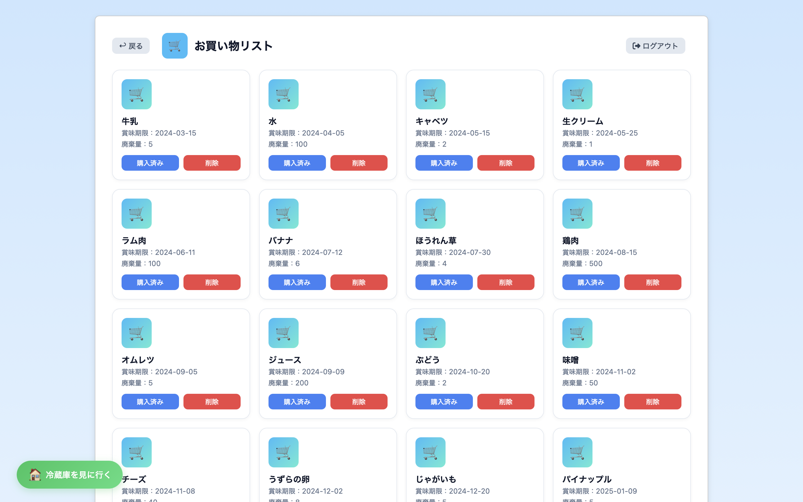

- **購入済み**ボタンを押すと、その食材の情報をすぐに登録できるようになっています。

- **削除**ボタンを押すと、買い物リストから削除することができます。
---

## 使用技術

| 分類 | 技術 |
|------|------|
| 言語 | Java / JavaScript |
| フレームワーク | Spring Boot |
| アーキテクチャ | MVC |
| ORM | Spring Data JPA |
| DB | MySQL |
| テンプレート | Thymeleaf |
| ビルド | Gradle |
| バージョン管理 | Sourcetree / GitHub |

---

## 設計・開発の工夫

本アプリでは、**実務を意識した設計とユーザビリティ向上**を重視しました。

- **画面設計 → テーブル設計 → API 設計 → 実装** の順で開発  
  → 後戻りを減らし、保守性を意識した構成  
- 食品データ管理では  
  - 賞味期限が近い順に並べる  
  - 入力項目を最小限に抑える  
  など、**直感的に操作できる UI/UX** を意識  
- Controller / Service / Repository の責務分離を徹底  

---

## 苦労した点・学び

最も苦労したのは、  
**Spring Boot における依存関係エラーや DB 接続設定の原因特定**です。

初期段階では、

- アプリが起動しない  
- データが保存されない  

といった問題が多発しました。

`application.properties`、Entity、Repository、Controller など  
複数ファイルに原因がまたがるケースもありましたが、

- スタックトレースの行番号確認  
- `Caused by` による根本原因の特定  
- 依存関係の解決方法の調査  

を徹底し、**ログを根拠に問題を切り分ける力**を身につけました。

---

## 今後の改善予定

- 消費期限通知機能の追加  
- 家族での共有を可能にする    
- レスポンシブ対応  

---

## 作者

- 宮下 優太  
- GitHub：https://github.com/yuta754

---

## 補足

本アプリは、  
**Java / Spring Boot / JavaScript による Web アプリ開発の基礎を実装レベルで習得すること**を目的に制作しました。  
設計・実装・エラー対応まで一通り自走して行っています。
